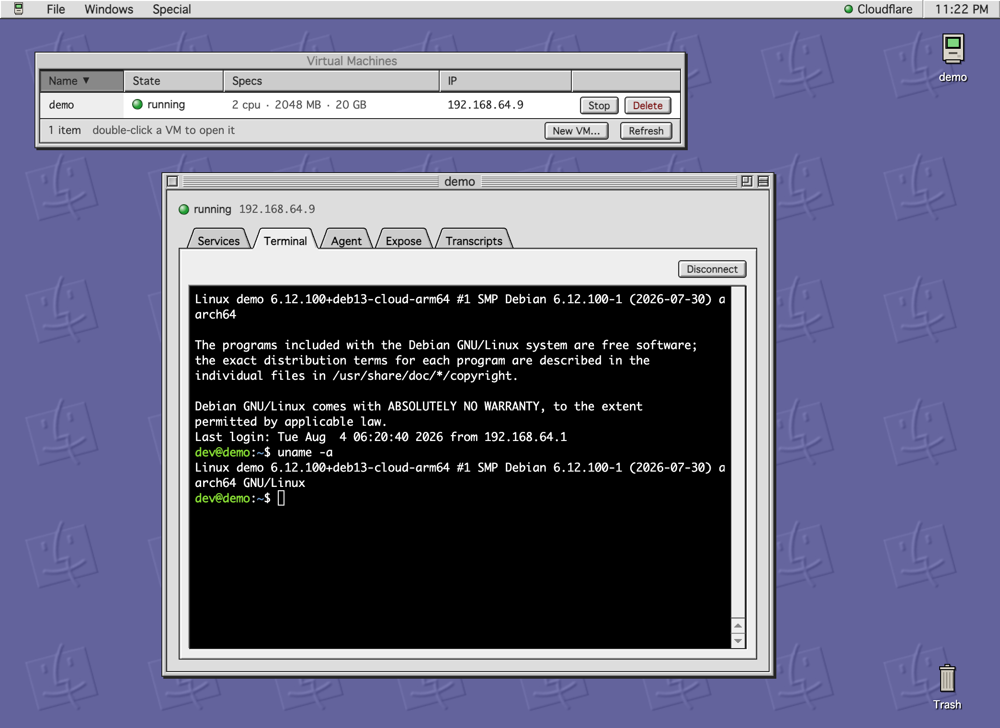

# exe — a personal VM cloud on your Mac

A single Go binary inspired by [exe.dev](https://exe.dev): create persistent Linux VMs on
macOS (Apple Virtualization.framework), vibecode inside them with models from
Ollama Cloud, and publish any VM port to a real HTTPS subdomain through your
Cloudflare Tunnel.



```
phone/laptop ──► exe API (bind to Tailscale IP)
                    │
                    ├── VMs  (Virtualization.framework, NAT, cloud-init, SSH)
                    │     └── agent: Ollama (glm-5.2, …) drives bash/write/read over SSH
                    │
                    ├── SSH gate :2222  (ssh exe@mac = lobby, ssh <vm>@mac = the VM)
                    │
                    └── reverse proxy :8090  ◄── cloudflared tunnel (LAN)  ◄── https://app.your.domain
                              └── Host header ──► VM_IP:PORT
```

## Quick start

```sh
make build        # builds ./exe and codesigns it with the virtualization entitlement
./exe init        # writes ~/.exe/config.json
./exe serve       # run the daemon (keep it running; VMs live inside this process)

./exe create demo               # ~7s: APFS-clone Debian 13, boot, cloud-init, SSH ready
./exe ssh demo                  # log in (key in ~/.exe/ssh/)
./exe code demo "build me a guestbook app on port 8000"
./exe expose demo -port 8000 -sub guestbook   # -> https://guestbook.<domain>
```

The first `create` downloads the Debian 13 `genericcloud` raw image (~3 GB) once
into `~/.exe/images/`.

## SSH as an interface (:2222)

Like [exe.dev](https://exe.dev) (`ssh exe.dev`), the daemon speaks SSH on
`:2222`. The SSH **username** picks where you land:

```sh
ssh -p 2222 exe@mac               # the lobby: an interactive REPL for VM lifecycle
ssh -p 2222 exe@mac ls --json     # one-shot commands, JSON for scripts/agents
ssh -p 2222 exe@mac new           # create + boot a VM (invents a name like fuzzy-otter)
ssh -p 2222 exe@mac code demo "add a /healthz endpoint"   # vibecode, streamed

ssh -p 2222 demo@mac              # full SSH *into* the VM (auto-starts it)
scp -P 2222 app.py demo@mac:~/    # scp, sftp, -L/-R port forwarding all pass through
ssh -p 2222 -L 8000:localhost:8000 demo@mac   # tunnel a VM port to your laptop
```

Lobby commands: `help`, `ls`, `new`, `start`, `stop`, `rm`, `ip`,
`code <vm> <prompt>`, `expose <vm> <port> [sub]`, `unexpose`, `routes` —
`--json` where it matters. The lobby is commands-only (no scp/sftp there);
`ssh <vm>@mac` is a transparent bridge to the VM's sshd, so everything works
there. The name `exe` is reserved for the lobby.

Who gets in: the service key (`~/.exe/ssh/id_ed25519`), any of the daemon
user's `~/.ssh/*.pub`, and keys listed in `~/.exe/ssh/authorized_clients`
(authorized_keys format — add your phone's key there; edits apply
immediately). The gate's host key lives at `~/.exe/ssh/host_ed25519`.
Configure the address with `ssh_listen` (`"off"` disables).

## Web UI

The daemon serves a single-page UI at `http://<listen>/` (default
http://127.0.0.1:7777). It can:

- list VMs with live state, and create / start / stop / delete them
- open a full SSH terminal in the browser (xterm.js over WebSocket, embedded in the binary)
- see web services listening inside a VM with one-click links
- vibe code inside a VM with streaming agent output
- browse every vibe-code transcript (CLI runs are recorded too, under
  `~/.exe/vms/<name>/transcripts/`)
- expose a VM port to your domain
- edit the full configuration (saved to `~/.exe/config.json` and hot-reloaded;
  fields marked `*` need a daemon restart)

If `api_token` is set, paste it into the token field in the header (stored in
localStorage). Bind `listen` to your Tailscale IP to use the UI from your phone.

## Configuration (~/.exe/config.json)

| key | meaning |
|---|---|
| `listen` | API address. `127.0.0.1:7777` default; bind your Tailscale IP (e.g. `100.120.160.126:7777`) to drive it from your phone |
| `proxy_listen` | reverse-proxy address the tunnel forwards to (default `:8090`) |
| `ssh_listen` | SSH gate address (default `:2222`): `ssh -p 2222 exe@mac` = lobby, `ssh -p 2222 <vm>@mac` = the VM. `"off"` disables |
| `advertise_host` | this Mac as reachable **from the cloudflared host** — LAN IP (e.g. `192.168.1.131`) or Tailscale IP |
| `api_token` | if set, every API call needs `Authorization: Bearer <token>`. Set it before binding beyond localhost |
| `ssh_user` | user created in each VM (default `dev`, passwordless sudo) |
| `image_url` | base image; any raw-format cloud image with cloud-init works |
| `ollama.base_url` | `http://127.0.0.1:11434` to go through your signed-in local Ollama (cloud models like `glm-5.2:cloud` need no key), or `https://ollama.com` + `ollama.api_key` |
| `ollama.model` | default agent model, e.g. `glm-5.2:cloud` |
| `cloudflare.*` | see below |

Secrets can also come from `OLLAMA_API_KEY`, `CLOUDFLARE_API_TOKEN`, `EXE_API_TOKEN`.

## Cloudflare setup (one time)

1. Use a **remotely-managed** tunnel (created in Zero Trust → Networks → Tunnels).
   `exe expose` edits its ingress rules via API; a locally-managed tunnel
   (config.yml on the cloudflared host) can't be updated this way — for those,
   add one catch-all ingress `*.your.domain -> http://<advertise_host>:8090`
   by hand instead, and exe will still manage DNS + routing.
2. API token with **Zone → DNS → Edit** and **Account → Cloudflare Tunnel → Edit**.
3. Fill `cloudflare.api_token`, `account_id`, `zone_id`, `tunnel_id`, `domain`.

`exe expose <vm> -port N [-sub name]` then:
creates/updates the CNAME `<sub>.<domain>` → `<tunnel>.cfargotunnel.com`,
upserts a tunnel ingress rule `<sub>.<domain>` → `http://<advertise_host>:8090`,
and routes that hostname in the local proxy to `http://<vm_ip>:N`.

## How VMs work

- Debian 13 arm64 raw cloud image, APFS copy-on-write clone per VM (instant, thin).
- EFI boot, virtio disk/net/console/entropy; serial console log at `~/.exe/vms/<name>/console.log`.
- cloud-init NoCloud seed ISO injects the `dev` user + the service SSH key and grows the disk.
- NAT networking via the shared macOS DHCP (`bootpd`); IPs are discovered from
  `/var/db/dhcpd_leases`, matching by MAC or, for DUID-identifying clients
  (Debian 13's dhcpcd), by lease name with a pre-boot snapshot to skip stale entries.
- **VMs run inside the `exe serve` process** — quit the daemon and they power off
  (disks persist; `exe start` boots them again). Run the daemon under `launchd`
  or in tmux for long-lived VMs.

## Security notes

- VMs are reachable only from this Mac (NAT); the proxy is what exposes them.
- Set `api_token` before binding the API beyond localhost.
- The agent has passwordless sudo **inside the VM** — that's the sandbox boundary.
- The SSH gate accepts only keys it already knows (service key, your
  `~/.ssh/*.pub`, `~/.exe/ssh/authorized_clients`) — there is no
  first-come key adoption, so it's safe to leave on `:2222` on a LAN.

## Roadmap / ideas

- Linux backend (KVM via cloud-hypervisor or QEMU) behind the same `vmm.Manager` interface.
- `exe unexpose` currently leaves the Cloudflare DNS record + ingress rule in place.
- Snapshots (`SaveMachineStateToPath` is already in vz), memory ballooning, virtiofs shares.
- Auto-restart VMs that were running when the daemon exited.
